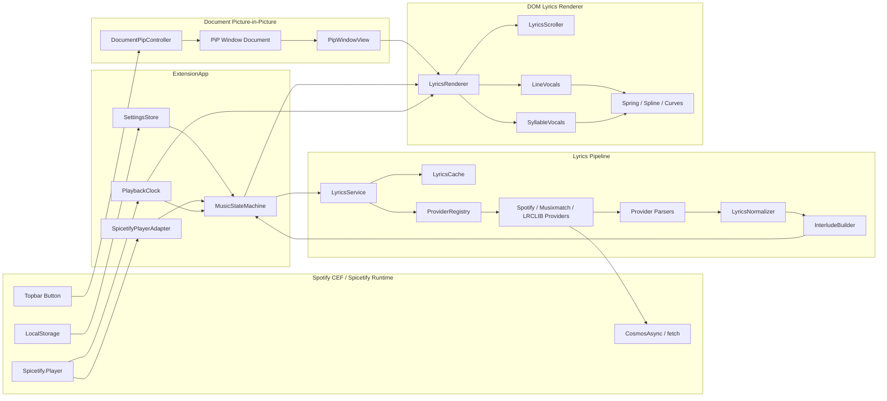
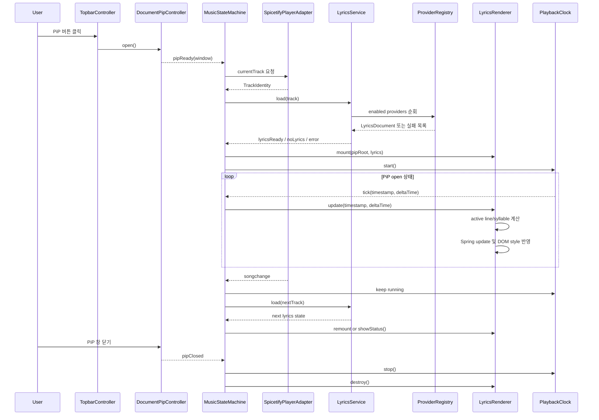

# Spicetify 동적 PiP 가사 확장 설계 문서

## 1. 목표

기존 `spicetify/cli`의 `Extensions/popupLyrics.js`를 대체하는 새 TypeScript 확장을 설계한다. 새 확장은 기존 구현의 공급자 fallback, 트랙 감지, 캐시, 설정 흐름은 계승하되, Canvas 기반 video Picture-in-Picture 렌더링을 제거하고 Document Picture-in-Picture API 위에서 DOM, CSS, Spring 기반 애니메이션으로 가사를 렌더링한다.

전제 조건은 Spotify CEF 환경에서 `documentPictureInPicture`가 `window`에 존재한다는 것이다. 따라서 PiP 창은 `HTMLVideoElement.requestPictureInPicture()`와 `canvas.captureStream()` 대신 `window.documentPictureInPicture.requestWindow()`로 생성한다.

## 2. 분석 요약

### 2.1 popupLyrics.js 구조

`popupLyrics.js`는 단일 파일에 워커, 공급자, PiP 렌더러, 설정 UI가 함께 들어 있다.

- Worker/메인 분기: 파일 시작부에서 `navigator.serviceWorker` 존재 여부로 Worker 코드와 메인 확장 코드를 나눈다. Worker 쪽은 `setInterval(..., 16.66)`로 `"popup-lyric-update-ui"` 메시지를 보내고, 메인 쪽은 문서가 hidden일 때 Worker tick을 사용한다. 근거: [popupLyrics.js](/Users/backgwangmin/Documents/spotify-lyris/cli/Extensions/popupLyrics.js:8), [popupLyrics.js](/Users/backgwangmin/Documents/spotify-lyris/cli/Extensions/popupLyrics.js:39)
- LyricProviders 3종: Spotify, Musixmatch, LRCLIB 순수 함수형 공급자를 갖고 모두 `{ lyrics }` 또는 `{ error }` 형태를 반환한다. 근거: [popupLyrics.js](/Users/backgwangmin/Documents/spotify-lyris/cli/Extensions/popupLyrics.js:99)
- Provider fallback: 설정의 `servicesOrder`를 순회하며 켜진 공급자를 호출하고, 성공하면 중단하며 URI 기준 `CACHE`에 저장한다. 근거: [popupLyrics.js](/Users/backgwangmin/Documents/spotify-lyris/cli/Extensions/popupLyrics.js:446)
- CanvasPiP: 숨겨진 `video`에 `canvas.captureStream()`을 연결하고, Topbar 버튼 클릭 시 `requestPictureInPicture()`를 호출한다. 커버 이미지는 별도 캔버스에 그려 배경 blur 소스로 쓴다. 근거: [popupLyrics.js](/Users/backgwangmin/Documents/spotify-lyris/cli/Extensions/popupLyrics.js:385)
- Canvas 렌더링: `renderLyrics()`가 현재 가사 index와 progress를 계산하고, focus/previous/next line을 캔버스에 그린 뒤 gradient mask를 적용한다. 근거: [popupLyrics.js](/Users/backgwangmin/Documents/spotify-lyris/cli/Extensions/popupLyrics.js:668)
- tick 루프: `Player.getProgress()`와 delay로 현재 시간을 만들고, 오류/로딩/가사 상태에 따라 캔버스에 텍스트 또는 가사를 렌더링한다. 가사가 없으면 1초 timeout, 가사가 있으면 visible 상태에서 `requestAnimationFrame`을 반복한다. 근거: [popupLyrics.js](/Users/backgwangmin/Documents/spotify-lyris/cli/Extensions/popupLyrics.js:785)

새 설계에서 유지할 것은 “공급자 fallback, 서비스 순서, delay, cache, 트랙 변경 이벤트”이고, 제거할 것은 “worker tick 우회, canvas paragraph layout, video PiP, 캔버스 커버 배경”이다.

### 2.2 beautiful-lyrics 동적 가사 구현

`beautiful-lyrics`는 가사 데이터 모델과 DOM 애니메이션 경계가 잘 분리되어 있다.

- 타입 계층: `Lyrics`는 `Static`, `Line`, `Syllable`의 discriminated union이다. `Line`은 `LineVocal | Interlude`, `Syllable`은 `SyllableVocalSet | Interlude`를 가진다. `SyllableVocalSet`은 Lead와 optional Background vocals를 가진다. 근거: [Lyrics.ts](/Users/backgwangmin/Documents/spotify-lyris/beautiful-lyrics/Universal/Types/Lyrics.ts:22)
- 파싱/변환: `TransformProviderLyrics()`는 타입별 텍스트를 모아 언어와 자연 정렬 방향을 추정하고, 한중일 romanization을 채운 뒤 긴 공백 구간에 Interlude를 삽입한다. 근거: [LyricUtilities.ts](/Users/backgwangmin/Documents/spotify-lyris/beautiful-lyrics/Extension/Spices/Spicetify/Services/Player/LyricUtilities.ts:154)
- 가사 로딩: Provider 원본 가사와 변환 가사를 별도 캐시하고, 원격 lyrics endpoint에서 받은 provider payload를 `TransformProviderLyrics()`로 변환한다. 근거: [mod.ts](/Users/backgwangmin/Documents/spotify-lyris/beautiful-lyrics/Extension/Spices/Spicetify/Services/Player/mod.ts:330)
- Syllable DOM: `SyllableVocals`는 음절을 단어 그룹으로 묶고, 긴 단일 음절은 letter span으로 다시 쪼갠다. 각 span은 scale, y-offset, glow Spring을 가진다. 근거: [SyllableVocals.ts](/Users/backgwangmin/Documents/spotify-lyris/beautiful-lyrics/Extension/Source/Modules/LyricsRenderer/Components/SyllableVocals.ts:17)
- Spring 애니메이션: spline으로 목표 scale/y-offset/glow를 계산하고, Spring의 `Final`을 바꾼 뒤 매 frame `Update(deltaTime)`로 DOM style을 갱신한다. 근거: [SyllableVocals.ts](/Users/backgwangmin/Documents/spotify-lyris/beautiful-lyrics/Extension/Source/Modules/LyricsRenderer/Components/SyllableVocals.ts:340)
- 상태 전환: 각 vocal은 `Idle | Active | Sung` 상태를 갖고, 현재 timestamp가 start/end 범위에 들어오면 Active, 지나면 Sung으로 바뀐다. 근거: [SyllableVocals.ts](/Users/backgwangmin/Documents/spotify-lyris/beautiful-lyrics/Extension/Source/Modules/LyricsRenderer/Components/SyllableVocals.ts:440)

새 설계는 타입 계층과 Spring 동작 방식을 참고하되, 코드는 직접 구현한다. 특히 `LegacySpring.ts`의 폐쇄형 damped spring 방정식은 동일한 수학 모델을 TypeScript 모듈로 재작성한다.

## 3. 설계 원칙

- 렌더링 대상은 PiP 창의 실제 DOM이다. Canvas, video stream, offscreen canvas를 사용하지 않는다.
- 내부 표준 가사 모델은 `Static | Line | Syllable`을 모두 수용하되, 렌더러의 1차 목표는 Syllable 및 Line 동기화다.
- 공급자는 각자 raw payload를 반환하지 않고 반드시 내부 `LyricsDocument`로 normalize한다.
- tick은 “플레이어 시간 수집”과 “렌더러 frame update”를 분리한다.
- PiP 창이 닫혀도 플레이어/가사 서비스는 안전하게 idle로 돌아가고, 다음 open 때 캐시를 재사용한다.

## 4. 디렉토리 구조

```text
src/
  extension.ts
  app/
    ExtensionApp.ts
    MusicStateMachine.ts
    TopbarController.ts
  pip/
    DocumentPipController.ts
    PipWindowView.ts
    pipStyles.ts
  player/
    SpicetifyPlayerAdapter.ts
    PlaybackClock.ts
    TrackIdentity.ts
  lyrics/
    types.ts
    LyricsService.ts
    LyricsCache.ts
    LyricsNormalizer.ts
    InterludeBuilder.ts
    providers/
      SpotifyProvider.ts
      MusixmatchProvider.ts
      LrclibProvider.ts
      ProviderRegistry.ts
    parsers/
      LrcParser.ts
      SpotifyColorLyricsParser.ts
      MusixmatchParser.ts
  renderer/
    LyricsRenderer.ts
    LyricsScroller.ts
    components/
      LineVocals.ts
      SyllableVocals.ts
      Interlude.ts
      StaticLyrics.ts
    animation/
      Spring.ts
      Spline.ts
      curves.ts
      LiveText.ts
  settings/
    SettingsStore.ts
    SettingsView.ts
  shared/
    EventEmitter.ts
    Result.ts
    dom.ts
```

빌드 산출물은 Spicetify extension 로더가 읽는 단일 JS와 CSS로 묶는다. 소스는 TypeScript 모듈로 유지하고, 배포 단계에서 `dist/aura-lyrics.js` 형태로 번들링한다.

### 4.1 전체 구조도



핵심 경계는 세 개다. Spicetify runtime은 플레이어 상태와 네트워크/저장소 접근만 제공하고, `Lyrics Pipeline`은 모든 provider 차이를 `LyricsDocument`로 흡수하며, `DOM Lyrics Renderer`는 PiP document 내부 DOM만 갱신한다.

## 5. 핵심 타입 설계

```ts
export type TimeRange = {
  startTime: number;
  endTime: number;
};

export type TextMetadata = {
  text: string;
  romanizedText?: string;
};

export type Interlude = TimeRange & {
  type: "interlude";
};

export type StaticLyrics = {
  type: "static";
  lines: TextMetadata[];
};

export type LineVocal = TimeRange &
  TextMetadata & {
    type: "vocal";
    oppositeAligned: boolean;
  };

export type LineLyrics = TimeRange & {
  type: "line";
  content: Array<LineVocal | Interlude>;
};

export type Syllable = TimeRange &
  TextMetadata & {
    isPartOfWord: boolean;
  };

export type SyllableVocal = TimeRange & {
  syllables: Syllable[];
};

export type SyllableVocalSet = {
  type: "vocal";
  oppositeAligned: boolean;
  lead: SyllableVocal;
  background?: SyllableVocal[];
};

export type SyllableLyrics = TimeRange & {
  type: "syllable";
  content: Array<SyllableVocalSet | Interlude>;
};

export type LyricsDocument = StaticLyrics | LineLyrics | SyllableLyrics;
```

`beautiful-lyrics`의 PascalCase 타입을 그대로 복사하지 않고, 새 확장 내부에서는 camelCase를 쓴다. Provider별 adapter가 외부 payload를 이 모델로 변환한다.

## 6. 주요 클래스와 역할

### 6.1 ExtensionApp

확장의 composition root다. Spicetify API 준비를 기다리고, 설정/플레이어/가사/PiP/렌더러를 연결한다.

주요 책임:

- `Spicetify.Player`, `CosmosAsync`, `LocalStorage`, `Topbar` 준비 확인
- `TopbarController` 등록
- `MusicStateMachine` 생성
- PiP open/close lifecycle 관리
- dispose 시 이벤트와 RAF 정리

### 6.2 DocumentPipController

Document Picture-in-Picture 창을 소유한다.

주요 메서드:

```ts
class DocumentPipController {
  isSupported(): boolean;
  open(options: PipOpenOptions): Promise<PipSession>;
  close(): void;
  onClose(listener: () => void): Unsubscribe;
}
```

동작:

- `window.documentPictureInPicture.requestWindow({ width, height })` 호출
- PiP document에 root container, style element, optional font preload 삽입
- opener document의 canvas/video와 독립적인 DOM tree를 유지
- PiP 창 unload/pagehide에서 app에 `pipClosed` 이벤트 전달

### 6.3 LyricsService

트랙 URI를 받아 가사를 로드한다.

주요 책임:

- `LyricsCache` 조회
- `ProviderRegistry`의 enabled provider를 설정 순서대로 호출
- stale 요청 방지용 request token 사용
- provider 성공 시 `LyricsNormalizer` 및 `InterludeBuilder` 적용
- 실패 사유를 `LyricsLoadState`로 표준화

```ts
type LyricsLoadState =
  | { status: "idle" }
  | { status: "loading"; track: TrackIdentity }
  | { status: "ready"; track: TrackIdentity; lyrics: LyricsDocument }
  | {
      status: "empty";
      track: TrackIdentity;
      reason: "no-lyrics" | "instrumental" | "unsupported-local";
    }
  | { status: "error"; track: TrackIdentity; message: string };
```

### 6.4 ProviderRegistry와 Providers

공급자를 TypeScript 클래스로 분리한다.

```ts
interface LyricsProvider {
  id: "spotify" | "musixmatch" | "lrclib";
  supports(track: TrackIdentity): boolean;
  fetch(
    track: TrackIdentity,
    context: ProviderContext,
  ): Promise<ProviderResult>;
}
```

- `SpotifyProvider`: Spotify color-lyrics endpoint를 호출한다. 기본은 line sync이며, 응답에 syllable/word timing이 있으면 `SyllableLyrics`로 승격한다.
- `MusixmatchProvider`: 기존 token 설정을 유지하고 macro subtitle 응답을 line lyrics로 변환한다.
- `LrclibProvider`: syncedLyrics의 `[mm:ss.xx]` line timestamp와 `<mm:ss.xx>` word/syllable timestamp를 모두 파싱한다. `<...>`가 있으면 syllable 후보로, 없으면 line lyrics로 만든다.

초기 버전에서 syllable data가 없는 provider는 line-level fallback을 제공한다. syllable 단위 동기화는 LRCLIB enhanced LRC 또는 Spotify payload에서 syllable/word timing을 확보할 수 있을 때 활성화한다.

### 6.5 LyricsRenderer

PiP root에 현재 `LyricsDocument`를 렌더링하고 frame update를 수행한다.

```ts
class LyricsRenderer {
  mount(
    root: HTMLElement,
    lyrics: LyricsDocument,
    options: RenderOptions,
  ): void;
  update(timestamp: number, deltaTime: number, flags?: RenderFlags): void;
  showStatus(status: StatusViewModel): void;
  destroy(): void;
}
```

구성:

- `StaticLyrics`: 정적 텍스트 목록
- `LineVocals`: 한 줄 단위 active/sung/idle 애니메이션
- `SyllableVocals`: 음절 및 강조 letter 애니메이션
- `Interlude`: 긴 무가사 구간 표시
- `LyricsScroller`: active group을 PiP viewport 중앙 근처로 이동

### 6.6 SyllableVocals

`beautiful-lyrics`의 동작을 새 확장에 맞게 재구현한다.

주요 동작:

- `Syllable[]`을 `isPartOfWord` 기준으로 word group span에 묶는다.
- 각 음절 span에 `LiveText`를 연결한다.
- duration이 길고 텍스트가 짧은 음절은 letter span으로 분해해 강조 애니메이션을 적용한다.
- `animate(songTime, deltaTime, immediate?)`에서 음절별 progress를 계산한다.
- progress로 scale/y-offset/glow target을 계산하고 Spring에 목표값을 설정한다.
- Spring update 결과를 CSS custom property와 `transform`, `scale`에 반영한다.

### 6.7 Spring, Spline, curves

Spring은 직접 구현한다. `beautiful-lyrics/Universal/Modules/LegacySpring.ts`의 모델처럼 damping ratio, frequency, velocity, position, final을 갖고 deltaTime 기반으로 position을 갱신한다.

```ts
class Spring {
  position: number;
  target: number;
  velocity: number;

  constructor(initial: number, dampingRatio: number, frequency: number);
  set(value: number): void;
  setTarget(value: number): void;
  update(deltaTime: number): number;
  isSleeping(): boolean;
}
```

곡선은 다음 기본값을 둔다.

- scale: `0 -> 0.95`, `0.7 -> 1.025`, `1 -> 1`
- y-offset: `0 -> 0.01em`, `0.9 -> -0.0167em`, `1 -> 0`
- glow: `0 -> 0`, `0.15 -> 1`, `0.6 -> 1`, `1 -> 0`

## 7. 데이터 흐름

```text
Topbar click
  -> DocumentPipController.open()
  -> PipWindowView.mount()
  -> MusicStateMachine starts active session

Spicetify.Player songchange
  -> SpicetifyPlayerAdapter emits trackChanged
  -> MusicStateMachine: TrackResolving
  -> LyricsService.load(track)
  -> LyricsCache lookup
  -> ProviderRegistry fallback
  -> Provider parser
  -> LyricsNormalizer
  -> InterludeBuilder
  -> LyricsRenderer.mount(lyrics)

PlaybackClock RAF
  -> read Player.getProgress() + settings.delay
  -> renderer.update(timestamp, deltaTime)
  -> component animate()
  -> Spring.update()
  -> DOM style update in PiP document
```

Canvas 기반 구현에서는 tick이 그리기와 상태 판단을 모두 수행했지만, 새 설계에서는 `PlaybackClock`이 시간만 공급하고 `MusicStateMachine`이 상태를 판단하며 `LyricsRenderer`가 DOM 업데이트만 맡는다.

### 7.1 런타임 시퀀스



## 8. 음악 상태 머신

```text
Closed
  openPiP -> Opening

Opening
  pipReady -> WaitingForTrack
  pipFailed -> Error
  closePiP -> Closed

WaitingForTrack
  validTrack -> LoadingLyrics
  invalidTrack/localOnly -> NoLyrics
  closePiP -> Closed

LoadingLyrics
  lyricsReady -> Rendering
  noLyrics -> NoLyrics
  providerError -> Error
  trackChanged -> LoadingLyrics
  closePiP -> Closed

Rendering
  playbackPlaying -> Playing
  playbackPaused -> Paused
  trackChanged -> LoadingLyrics
  lyricsEnded -> Ended
  closePiP -> Closed

Playing
  pause -> Paused
  seek -> Seeking
  trackChanged -> LoadingLyrics
  closePiP -> Closed

Paused
  play -> Playing
  seek -> Seeking
  trackChanged -> LoadingLyrics
  closePiP -> Closed

Seeking
  seekSettled -> Playing | Paused
  trackChanged -> LoadingLyrics
  closePiP -> Closed

NoLyrics
  trackChanged -> LoadingLyrics | WaitingForTrack
  refresh -> LoadingLyrics
  closePiP -> Closed

Error
  retry -> LoadingLyrics
  trackChanged -> LoadingLyrics
  closePiP -> Closed

Ended
  seekBeforeEnd -> Seeking
  trackChanged -> LoadingLyrics
  closePiP -> Closed
```

상태별 UI:

- `Closed`: Topbar inactive, RAF 정지
- `Opening`: PiP skeleton 표시
- `WaitingForTrack`: “재생 중인 트랙 대기”
- `LoadingLyrics`: 커버 배경과 loading shimmer
- `Rendering/Playing/Paused/Seeking/Ended`: lyrics DOM 유지, 상태에 따라 animation tick 유지 또는 저빈도 업데이트
- `NoLyrics`: instrumental/no synced lyrics/local track 메시지
- `Error`: provider 오류와 retry 버튼 표시

## 9. tick 및 frame 정책

기존 worker tick은 video PiP와 Spotify minimized throttling을 우회하기 위한 장치였다. Document PiP에서는 별도 창 document가 존재하므로 기본은 PiP window의 `requestAnimationFrame`을 사용한다.

정책:

- PiP open 중에만 RAF 실행
- playing 상태에서는 매 frame update
- paused 상태에서는 seek 또는 spring이 sleeping이 아닐 때만 update
- hidden opener document 여부와 무관하게 PiP window RAF를 우선 사용
- PiP RAF가 멈추는 환경이 발견되면 fallback으로 PiP window `setTimeout(1000 / 60)`을 사용한다
- 가사 미로드/오류 상태에서는 1초 단위 status refresh만 수행한다

## 10. 렌더링 구조와 CSS

PiP document DOM:

```html
<main class="pip-lyrics-app">
  <div class="background">
    
    <div class="scrim"></div>
  </div>
  <section class="lyrics-scroll-container">
    <div class="lyrics naturally-aligned-left">
      <button class="vocals-group active">
        <div class="vocals lead active">
          <span class="word">
            <span class="lyric syllable synced">...</span>
          </span>
        </div>
      </button>
    </div>
  </section>
</main>
```

핵심 CSS 변수:

```css
:root {
  --lyrics-size: 42px;
  --lyrics-color: rgba(255, 255, 255, 0.96);
  --lyrics-muted-color: rgba(255, 255, 255, 0.34);
  --gradient-progress: 0%;
  --text-shadow-blur-radius: 4px;
  --text-shadow-opacity: 0%;
  --cover-blur: 36px;
}
```

Syllable span은 `background-clip: text` 또는 pseudo-element overlay로 sung progress를 표현한다. Glow는 `text-shadow`와 CSS 변수로 제어한다. 줄 스크롤은 `transform: translate3d(0, y, 0)`으로 처리해 layout thrash를 줄인다.

## 11. 설정과 호환성

기존 LocalStorage key는 가능한 유지한다.

- `popup-lyrics:smooth`
- `popup-lyrics:center-align`
- `popup-lyrics:show-cover`
- `popup-lyrics:font-size`
- `popup-lyrics:blur-size`
- `popup-lyrics:font-family`
- `popup-lyrics:delay`
- `popup-lyrics:services:*`
- `popup-lyrics:services-order`

새 설정은 prefix를 `aura-lyrics:*`로 두되, 최초 실행 시 기존 `aura-lyrics:*`와 `popup-lyrics:*` key를 migration한다. 사용자가 기존 `popupLyrics.js` 또는 이전 개발 빌드에서 설정한 공급자 순서와 delay가 사라지지 않게 하는 것이 목표다.

## 12. 에러 처리

- Provider별 실패는 `ProviderError`로 누적하고, 모든 provider 실패 시 최종 상태를 만든다.
- 현재 트랙이 바뀌면 이전 provider promise 결과는 request id 비교로 무시한다.
- local track은 provider 호출 전에 `unsupported-local`로 종료한다.
- PiP API가 없으면 Topbar 클릭 시 안내 toast를 표시한다.
- PiP window 생성 후 stylesheet 삽입 실패 시 window를 닫고 `Error` 상태로 전환한다.

## 13. 테스트 전략

- Unit: `LrcParser`, `LyricsNormalizer`, `InterludeBuilder`, `Spring`, `MusicStateMachine`
- Fixture: Spotify line payload, Musixmatch subtitle payload, LRCLIB synced/enhanced LRC
- DOM test: `SyllableVocals.animate()`가 active/sung class와 CSS 변수 값을 갱신하는지 확인
- Manual Spicetify test: PiP open/close, track change, pause/play, seek, delay 변경, provider fallback, cover background, CEF Document PiP 동작

## 14. 구현 순서 제안

1. 타입, Spring, parser, normalizer를 먼저 구현한다.
2. Spotify, Musixmatch, LRCLIB provider를 TypeScript provider로 분리하고 line lyrics까지 동작시킨다.
3. Document PiP 창과 기본 status UI를 만든다.
4. Line renderer를 연결해 기존 popupLyrics 수준의 기능을 DOM으로 대체한다.
5. LRCLIB enhanced LRC 또는 Spotify payload에서 syllable timing을 파싱해 Syllable renderer를 활성화한다.
6. Spring 기반 syllable/letter animation과 scroller를 붙인다.
7. 설정 UI와 기존 LocalStorage migration을 마무리한다.
